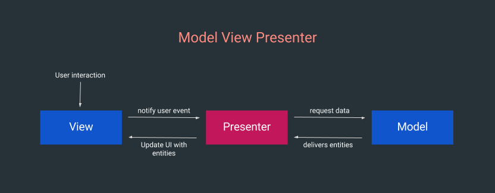

## MODEL VIEW PRESENTER  

Llevar acabo una buena estructura de nuestro código, para que este sea más sencillo de entender y modificar  
en un futuro, no es una tarea fácil. **Model View Controler** es un patrón que se separa las vistas de la lógica.  

####Model View Contrler (MVC) fases####

**Modelo:** Esta fase se encarga de ver la lógica de lo que se quiere hacer con la aplicación "Que es lo que se  
quiere mostrar".  
**Vistas:** Se encarga de dibujar las vistas de nuestra aplicació "Como lo vamos a mostrar".
**Controladores:** Es la fase encargada de intercambiar mensajes en las vistas y los modelos, esto la hace a trávez  
del uso de activities, fragments y services. Da un formato a los modelos para su visualización ymanipula eventos.  

####Problema del uso de MVC####

El problema de usar Model View Controler se da cuando la lógica de las vistas cambian, como la logíca y la vista  
estan ligadas se hace necesario agregar más código, y si se necesitan actividades o fragmentos que hagan casi lo  
mismo, sera necesario duplicar,haciendo más grande nuestro código. **"El mal uso de este patrón genera un anti patrón".**

####Model View Presenter (MVP)####

Es un patrón derivado de MVC el cual se encarga de solo de la lógica de la capa de presentación. No esun patrón de  
arquitectura. Nos permite separar la capa de pintado, esto nos lleva a que si se hace buen uso de la flexibilidad  
podriamos tener diferentes tipos de vistas para un lógica.  

####Fases de  MVP####

**View:** Representa una vista del SDK, esto se refiere a que es la abstracción de lo que se puede representar comn   
una vista.  
**Presenter:** En cargado de coordinar la implementación de la vista y el modelo.  
**Model:** Es el proveedor de los datos que queremos mostrar en la vista.  

  
